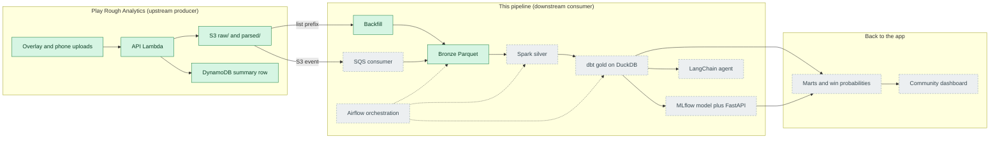

# pokemon-meta-pipeline


The analytics data platform for Play Rough Analytics, a web application
(TypeScript, AWS Lambda API, DynamoDB, React single-page application) where
players upload Pokemon Trading Card Game (TCG) Live battle logs. That
application is the upstream producer and system of record: it parses each log
into a per-game JSON blob and writes it to a private Amazon Simple Storage
Service (S3) bucket. This pipeline is a downstream consumer: it reads
those blobs, replaces every player handle with a keyed token, and builds a
metagame warehouse out of them (archetype win rates, a matchup matrix, cards
seen, a win-probability model, an agent that answers questions over the marts).
The results are meant to flow back to the application, so its community views
can be served by this pipeline's output.



Legend: green solid nodes exist and run today; grey dashed nodes are planned.

## Data contract

One file defines the interface between the two repositories:
`contract/parsed-blob.schema.json`, exported from the application's Zod
schemas. The producer validates with Zod on write, this pipeline validates with
Pydantic on read, and a test asserts the Pydantic models still match that JSON
Schema, so a change upstream fails here as a named contract break rather than a
wrong column. The contract is versioned: blobs carry `schemaVersion: 2`, and a
blob without it is the pre-contract v1 shape, quarantined rather than guessed
at. Fields are defined in [docs/schema.md](docs/schema.md).

## Status (what runs today)

Bronze ingest is real. The backfill has run against the production bucket:
**128 games, 0 quarantined, 10 play-date partitions**, all handles anonymized
and leak-checked before anything was written.

```bash
uv sync --group dev                                            # install, dev group included
op run --env-file=.env.op -- uv run python -m pipeline.backfill # full backfill from S3
uv run pytest                                                  # unit and contract tests
```

`op run` is the 1Password command-line interface; it injects `HANDLE_HMAC_KEY`
from the vault so the key never lands on disk. Without 1Password, export the
variables listed in `.env.example` yourself and run the module directly.
`--dry-run` validates without writing, `--limit N` stops after N blobs, and
`python -m pipeline.backfill --source-dir tests/fixtures` runs the same code
path over the committed games with no AWS account ([docs/demo.md](docs/demo.md)).
Query the result with DuckDB, which reads the Parquet files in place:

```bash
uv run python -c "import duckdb; duckdb.sql(\"select play_date, count(*) games from read_parquet('data/lake/bronze/**/*.parquet', hive_partitioning=true) group by 1 order by 1\").show()"
```

Quality gates, all enforced in continuous integration (CI) on Python 3.11 and
3.12: `ruff check` and `ruff format --check`, `mypy` with untyped definitions
disallowed, `pytest` with a 70% coverage floor, and the checked-in contract
file tested against the reader.

## Roadmap

Stage by stage, as defined in [docs/stages.md](docs/stages.md).

- [x] Repository, CI, and the docs set (concepts, discovery, schema, stages)
- [x] Data contract: exported JSON Schema plus Pydantic readers and their tests
- [x] Bronze backfill from S3: validate, anonymize, quarantine, partitioned write
- [x] HMAC anonymization with a post-write leak check
- [x] Committed anonymized fixtures and a refresh script
- [x] Data-handling, consent, deletion and key-rotation policy
- [ ] Event-driven ingest: S3 notification to an Amazon Simple Queue Service
      (SQS) queue with a dead-letter queue, drained by a consumer
- [ ] Silver in PySpark: typed tables, cards exploded, archetypes resolved
- [ ] Gold in dbt on DuckDB: star schema and marts, with dbt tests
- [ ] Win-probability model in MLflow, FastAPI serving, drift report
- [ ] LangChain agent: structured query language (SQL) over the marts and
      card-text retrieval, scored against a golden question set
- [ ] Airflow directed acyclic graph (DAG) with structured logs and metrics
- [ ] Publish marts and per-archetype predictions back to the application
- [ ] Stretch: AWS Step Functions as the managed alternative to Airflow

## Scope and limits

Each limit is a deliberate choice, with the reason and what changes at scale.

- **The corpus is small.** 128 games from a handful of players: 57 stock
  exports without shared decklists, 67 with shared decklists, 4 logged by hand.
  The win-probability model is therefore a demonstration of the machine
  learning operations loop, not a strong predictor; its metric will be
  cross-validated and reported next to the sample size.
- **No Kafka.** The producer already runs on AWS, so an S3 event notification
  into one SQS queue with a dead-letter queue covers the requirement. At higher
  volume the consumer is the piece that changes (batch reads, more workers, or
  a Spark job over an S3 inventory report); the contract does not.
- **No Kubernetes.** The producer is Lambda, local runs are containers and
  Compose, and the orchestration layer is Airflow with Step Functions as the
  AWS-managed option. Nothing here needs a cluster to stay up.
- **No geospatial data.** Games carry no location, so nothing here pretends to.
- **Cards seen are not decklists.** A stock export reveals only the cards a
  side played or revealed, so inclusion rates over stock games are lower
  bounds; a full decklist exists only when the opponent shared it in-game. The
  marts label the two differently and never average them together.
- **Player identity is a keyed token.** Handles become HMAC (keyed-hash message
  authentication code) tokens before any file is written, and a leak check
  quarantines any game whose handles survived the rewrite. See
  [docs/data-handling.md](docs/data-handling.md).
- **S3 only.** The pipeline reads the bucket, never the application's
  operational database, so it cannot slow the application down.

## Why these choices

- **Spark for silver.** The explodes and joins are where the data grows, and
  the same tested transforms run on a laptop SparkSession and on a cluster. At
  a million games the partitioning and cluster config change, the code does not.
- **dbt on DuckDB for gold.** dbt makes the transformations tested SQL with
  generated lineage, and DuckDB queries the Parquet files in place with no
  server. Swapping the adapter moves the same models to a warehouse.
- **MLflow for the model.** Every training run's parameters, metrics and
  artifacts are recorded, and the registry adds a promotion step. It replaces a
  hand-kept experiment log, the thing that always goes stale first.
- **DuckDB as the engine.** An in-process analytics engine over Parquet means
  zero infrastructure for a corpus this size, and the same SQL runs in tests,
  in dbt and in the agent's read-only connection.
- **Pydantic plus JSON Schema.** One contract file that both languages test
  against, so producer and consumer cannot disagree silently.
- **Parquet with Hive partitions.** Columnar and compressible, and the
  `play_date=` folders let a query skip whole files.
- **HMAC anonymization.** Deterministic tokens keep per-player joins working,
  and the secret key makes a dictionary attack on short handles impossible.

## Source data

The source is the application's private S3 bucket; nothing from it is committed
here. Access is configured through environment variables (`.env.example`):

```
PRA_BUCKET        S3 bucket that holds parsed/{userId}/{gameId}.json
PRA_PREFIX        key prefix to read, default parsed/
AWS_REGION        bucket region, default us-west-2
AWS_PROFILE       optional named AWS profile
HANDLE_HMAC_KEY   secret used to anonymize player handles; never commit it
PIPELINE_DATA_DIR where the lake and warehouse are written, default ./data
```

One run reads every blob under the prefix, lands the valid ones in bronze and
quarantines the rest under `data/lake/quarantine/` with a reason code.

## Layout

```
pipeline/          Python package: contract, anonymization, bronze, backfill
pipeline/legacy/   deprecated first source (Kaggle corpus), kept for reference
contract/          parsed-blob.schema.json, copied verbatim from the producer
scripts/           maintenance commands, including the fixture refresh
tests/             unit, contract and data-quality tests
tests/fixtures/    committed anonymized stock games, no decklists
docs/              concepts, discovery, schema, stage plan, decision records
data/              local lake and warehouse output (gitignored)
dbt/               planned: dbt project (DuckDB), staging, star schema, marts
dags/              planned: Airflow DAG definitions
```

## Docs

- [concepts.md](docs/concepts.md) the data-engineering vocabulary, term by term
- [discovery.md](docs/discovery.md) what the source contains, and what follows
- [schema.md](docs/schema.md) the contract field by field, and the bronze tables
- [stages.md](docs/stages.md) the stage plan: inputs, outputs, status, scale
- [data-handling.md](docs/data-handling.md) collection, anonymization, what is
  never published, deletion and key rotation
- [demo.md](docs/demo.md) running the pipeline on the fixtures, no AWS account
- [adr/](docs/adr/) architecture decision records

The original stage 1, built against a finished Kaggle competition's replay
corpus, is deprecated, wired into no stage, and kept under
`pipeline/legacy/kaggle/`; see [docs/adr/0001](docs/adr/0001-deprecate-kaggle-source.md).
