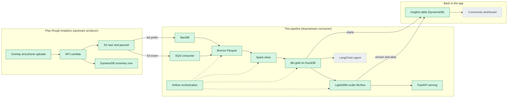

# pokemon-meta-pipeline


The analytics data platform for Play Rough Analytics, a web application
(TypeScript, AWS Lambda API, DynamoDB, React single-page application) where
players upload Pokemon Trading Card Game (TCG) Live battle logs. That
application is the upstream producer and system of record: it parses each log
into a per-game JSON blob and writes it to a private Amazon Simple Storage
Service (S3) bucket. This pipeline is a downstream consumer: it reads
those blobs, replaces every player handle with a keyed token, and builds a
metagame warehouse out of them (archetype win rates, a matchup matrix, cards
seen, a win-probability model, an agent that answers questions over the marts).
The results are meant to flow back to the application, so its community views
can be served by this pipeline's output.



Legend: green solid nodes exist and run today; grey dashed nodes are planned.

## Data contract

One file defines the interface between the two repositories:
`contract/parsed-blob.schema.json`, exported from the application's Zod
schemas. The producer validates with Zod on write, this pipeline validates with
Pydantic on read, and a test asserts the Pydantic models still match that JSON
Schema, so a change upstream fails here as a named contract break rather than a
wrong column. The contract is versioned: blobs carry `schemaVersion: 2`, and a
blob without it is the pre-contract v1 shape, quarantined rather than guessed
at. Fields are defined in [docs/schema.md](docs/schema.md).

## Status (what runs today)

Bronze ingest is real. The backfill has run against the production bucket:
**128 games, 0 quarantined, 10 play-date partitions**, all handles anonymized
and leak-checked before anything was written.

Silver is real too. `python -m pipeline.silver` reads those bronze partitions
with PySpark and writes four tables (`games`, `game_sides`, `turns`,
`cards_seen`), archetype names resolved through an alias map built from bronze
itself and non-member tokens dropped, then reconciles the row counts against
bronze and exits non-zero if they do not add up.

Gold is real. `python -m pipeline.gold` runs a dbt project on DuckDB over
those silver files, read in place with no load step, and builds a star schema
at the (game, seat) grain: `fct_game_side`, six dimensions and four marts
(matchups, archetype by week, cards seen, player summary). It ends with
`dbt test`, 105 key, relationship, accepted-value and singular tests, and exits
non-zero if any of them fail.

The model stage is real, and small. The same dbt run builds `features_turn`,
one row per (game, seat, turn) holding the board at the **start** of that turn,
and `python -m pipeline.train` trains a LightGBM classifier on it inside an
MLflow run: hyperparameters, log loss and area under the curve on train and
holdout, a calibration plot, feature importances, the feature list and the
model with its signature. A second run in the same experiment is the baseline
it has to beat, the archetype pair's historical win rate, and `beats_baseline`
is logged as a metric either way. The split is by date, never random. The
honest size of it: 128 games land in bronze, 28 carry an archetype on both
seats, and `features_turn` is **596 rows**. That demonstrates the loop; it does
not make a good predictor, and [docs/features.md](docs/features.md) says so
column by column.

The registry and the serving stage are real too. Every training run registers a
new version of the `win-probability` model, tagged with its holdout numbers, and
serves nothing: `python -m pipeline.promote` is the gate. It compares the
candidate with whatever holds the `production` alias and moves the alias only if
the candidate beats the win-rate baseline **and** is at least as good on holdout
log loss; otherwise the version stays at `staging` with the reason written onto
it. `python -m pipeline.serve` is a FastAPI service that loads
`models:/win-probability@production` and answers `POST /predict`, so promoting a
model is a pointer move rather than a deploy.

A model is a claim about a distribution, and the claim expires quietly, so
`python -m pipeline.drift` compares the training window against the most recent
window of `features_turn`: a population stability index per numeric feature
over ten quantile bins fitted on the reference, the two archetype columns
pooled into one metagame mix with a chi-square test and a PSI of its own, and
the win rate of both windows as a concept-drift hint. It writes
`drift_report.md` and `drift_summary.json`, logs both as artifacts of a run in
the `win-probability-drift` experiment, prints one verdict line and exits 0
whether or not it flagged. It never retrains: on a corpus this small the flag
is a prompt to look, and `train` then `promote` is what acts on it.

Orchestration is real, in two shapes over one list of stages.
`python -m pipeline.run_all` runs every stage in order as a subprocess of the
same interpreter, under one `PRA_RUN_ID`, stopping at the first non-zero exit
and closing with a table of what ran, what was skipped and how long each took:
the whole pipeline over the committed fixtures is about twenty seconds.
`docker compose up -d airflow` is the same list as a daily Airflow DAG,
`backfill >> spark_silver >> dbt_run >> dbt_test >> build_features >> train >>
promote >> drift >> quality_gate >> publish`, every task a `BashOperator`
calling one of the commands below so the DAG holds no pipeline logic of its own.
Both run `python -m pipeline.quality_gate` before the publish, which reads
`mart_pipeline_health` and fails the run when a stage's last run failed or its
quarantine rate is over the threshold: that is what turns a telemetry row into a
red run, and it is why numbers a gate would have refused never reach the
application.

The loop closes. `python -m pipeline.publish` writes the marts into the
application's DynamoDB table (`PRA_INSIGHTS_TABLE`), keyed the way its pages
read them: `MATCHUP` by ordered archetype pair, `WEEKLY#<archetype>` by ISO
week, `ARCHETYPE` for the leaderboard, and one `META` row carrying the run
identifier, the game count and whichever model version holds the `production`
alias. A publish is a refresh rather than a merge: every row goes in under the
new run identifier, in batches of 25, and the rows of the previous run are
deleted afterwards, so a reader mid-publish sees old numbers or new ones and
never a gap. `--dry-run` builds every item and prints the counts and samples
without an account that can write. On the production warehouse that is 180
matchup rows, 109 weekly rows, 80 archetype rows and the meta row, from 289
mart rows and 128 games.

The serving stage is instrumented, which is the one place a run-per-stage row
does not fit. Every request is an OpenTelemetry span with a `predict.inference`
child around the model call, exported to a collector when one is configured and
a no-op when there is not; `GET /metrics` is a Prometheus exposition of request
rate and latency by route, inference latency and prediction counts by model
version, and an agent tool-call counter stage 6 will start using.
`docker compose --profile observability up -d predict grafana` adds the
collector, Jaeger, Prometheus and a provisioned Grafana dashboard next to the
service, and the default `docker compose up -d mlflow predict` is still the two
containers it has always been.

```bash
uv sync --group dev                                            # install, dev group included
op run --env-file=.env.op -- uv run python -m pipeline.backfill # full backfill from S3
uv run python -m pipeline.consume                              # drain the event queue into bronze
uv run python -m pipeline.silver                               # bronze -> silver, needs Java
uv run python -m pipeline.gold                                 # silver -> gold, dbt on DuckDB
uv run python -m pipeline.train                                # gold -> model, tracked in MLflow
uv run python -m pipeline.promote                              # judge the newest version
uv run python -m pipeline.serve                                # serve the promoted one, port 8000
uv run python -m pipeline.drift                                # feature drift against the train window
uv run python -m pipeline.quality_gate                         # fail if a stage's last run failed
uv run python -m pipeline.publish --dry-run                    # the marts as they would be published
uv run python -m pipeline.run_all --source-dir tests/fixtures  # every stage above, in order
uv run pytest                                                  # fast suite, no JVM
uv run pytest -m spark                                         # silver tests, needs Java 17+
uv run pytest -m dbt                                           # gold tests, silver then dbt
uv run pytest -m ml                                            # model, promotion and drift, no JVM
```

`promote` prints one line and exits 0 whether or not it promoted, because a
refusal is the gate working:

```
promoted: version 3 improves holdout logloss to 0.1987 from 0.2510 at version 1.
rejected: version 4 has holdout logloss 0.3682 against 0.1987 at version 3.
```

With a version promoted, the service answers:

```bash
uv run python -m pipeline.serve &
curl -s -X POST localhost:8000/predict -H 'content-type: application/json' -d '{
  "turn_number": 8, "went_first": true,
  "archetype_key": "name:charizard-ex", "opponent_archetype_key": "name:gardevoir-ex",
  "prizes_taken_self": 3, "prizes_taken_opp": 1,
  "knockouts_self": 3, "knockouts_opp": 1, "cards_drawn_self": 26,
  "energy_attached_self": 5, "pokemon_played_self": 6, "trainers_played_self": 15,
  "evolutions_self": 2, "attacks_self": 4, "turns_played_self": 4 }'
# {"win_probability":0.4469,"model_name":"win-probability","model_version":"3",
#  "model_alias":"production","features_used":[...],"unknown_archetypes":[]}
```

`GET /health` says whether a model is loaded, `GET /model` says which version
and how it scored, `POST /reload` picks up a promotion without a restart, and
`/docs` is the generated schema. An archetype the model never trained on is
answered and named in `unknown_archetypes` rather than refused, and a service
that starts before anything is promoted stays up and reports
`model_loaded: false`.

Training records its runs, and the registry its versions, in a plain
directory, `data/mlruns`, unless `MLFLOW_TRACKING_URI` says otherwise. To read
them in a browser:

```bash
MLFLOW_ALLOW_FILE_STORE=true uv run mlflow ui --backend-store-uri data/mlruns
docker compose up -d mlflow   # or a real server, SQLite-backed, on port 5000
export MLFLOW_TRACKING_URI=http://localhost:5000
```

MLflow 3 keeps the plain directory store behind that opt-in variable, which
the three model commands set for themselves and the user interface does not.
The compose service is the version with a database behind it, and it is what a
registry shared by more than one machine needs; `docker compose up -d predict`
runs the serving container beside it. On macOS LightGBM also needs the OpenMP
runtime, which is `brew install libomp`.

`op run` is the 1Password command-line interface; it injects `HANDLE_HMAC_KEY`
from the vault so the key never lands on disk. Without 1Password, export the
variables listed in `.env.example` yourself and run the module directly.
`--dry-run` validates without writing, `--limit N` stops after N blobs, and
`python -m pipeline.backfill --source-dir tests/fixtures` runs the same code
path over the committed games with no AWS account ([docs/demo.md](docs/demo.md)).
Query the result with DuckDB, which reads the Parquet files in place:

```bash
uv run python -c "import duckdb; duckdb.sql(\"select play_date, count(*) games from read_parquet('data/lake/bronze/**/*.parquet', hive_partitioning=true) group by 1 order by 1\").show()"
```

The event path exists as a command: `python -m pipeline.consume` drains S3
notifications from an SQS queue into the same bronze write and removes a game
when its object is deleted, with the queue, its dead-letter queue and the bucket
notification still to be deployed ([docs/stages.md](docs/stages.md)).

The four test commands are one suite split by cost: the default run skips
anything marked `spark`, `dbt` or `ml`, `-m spark` runs the silver tests, each
of which starts a Java Virtual Machine (JVM), `-m dbt` builds silver from the
committed games and then runs the whole dbt project over it, and `-m ml` trains
a real model on a synthetic feature table it writes into a temporary DuckDB
file, so it needs no Java at all. CI runs all four and gates on their combined
coverage. `scripts/fetch_catalog.py` downloads the
card catalog silver joins against; the stage runs without it, with null catalog
columns.

Every stage logs the same way and records the same row. `pipeline/observability.py`
installs a standard-library JSON logger on standard error (one object per line
with `ts`, `level`, `logger`, `stage`, `run_id`, `msg` and whatever fields the
call passed) and renders the same records as one readable line each in a
terminal or under `PRA_LOG_FORMAT=console`. Standard output stays the command's
own result, so a summary block is still a table a person reads while the log
beside it stays parseable. Every stage of one run shares a `run_id`, from
`PRA_RUN_ID` when a scheduler sets one, and closes by writing a single Parquet
row to `data/lake/run_metrics/` with its duration, its rows in, out and
quarantined, and `ok` or `failed`. Two dbt models read that back: `run_metrics`
and `mart_pipeline_health`, one row per stage with the last run's outcome and
the quarantine rate over the last ten. The two commands that never finish say it
differently: `python -m pipeline.consume` writes that row per receive batch and
nothing for an idle poll, and `python -m pipeline.serve` logs a record per
request instead, because a service has no run to close.

```bash
PRA_RUN_ID=nightly-1 uv run python -m pipeline.backfill --source-dir tests/fixtures
uv run python -c "import duckdb; duckdb.sql(\"select stage, last_status, last_duration_s, quarantine_rate from read_parquet('data/lake/run_metrics/*.parquet')\").show()"
```

Under the scheduler that identifier is Airflow's own, so one DAG run is one
string in the user interface, in every log line and in every `run_metrics` row:

```bash
docker compose build airflow
docker compose up -d airflow mlflow            # http://localhost:8080, admin/admin
docker compose exec airflow airflow dags trigger play_rough_pipeline \
  --conf '{"source_dir": "tests/fixtures", "ingest_mode": "backfill"}'
docker compose down
```

The image is Airflow with the project's dependencies in a virtual environment of
their own, exported from `uv.lock`, and the repository bind mounted beside it,
so a task runs the working tree and only a dependency change needs a rebuild.
`source_dir` empty reads the S3 bucket instead of the fixtures, and
`ingest_mode=consumer` turns the ingest task into a logged no-op for when the
event-driven consumer is the one landing bronze. Details in
[docs/stages.md](docs/stages.md) section 7.

Quality gates, all enforced in continuous integration (CI) on Python 3.11 and
3.12: `ruff check` and `ruff format --check`, `mypy` with untyped definitions
disallowed, all four pytest runs with a 70% coverage floor on the combined
number, and the checked-in contract file tested against the reader.

## Roadmap

Stage by stage, as defined in [docs/stages.md](docs/stages.md).

- [x] Repository, CI, and the docs set (concepts, discovery, schema, stages)
- [x] Data contract: exported JSON Schema plus Pydantic readers and their tests
- [x] Bronze backfill from S3: validate, anonymize, quarantine, partitioned write
- [x] HMAC anonymization with a post-write leak check
- [x] Committed anonymized fixtures and a refresh script
- [x] Data-handling, consent, deletion and key-rotation policy
- [ ] Event-driven ingest: S3 notification to an Amazon Simple Queue Service
      (SQS) queue with a dead-letter queue, drained by a consumer
- [x] Silver in PySpark: typed tables, cards exploded, archetypes resolved
- [x] Gold in dbt on DuckDB: star schema and marts, with dbt tests
- [x] Per-turn feature table in dbt, with a date-based train and holdout split
- [x] Win-probability model in LightGBM, tracked in MLflow against a baseline
- [x] Model registry with a promotion step: aliases, not stages, and a rule
      that refuses a worse candidate and says why
- [x] FastAPI serving of whichever version holds the `production` alias
- [x] Drift report: population stability index per feature and an archetype-mix
      comparison, written to a report and logged as an MLflow run
- [ ] LangChain agent: structured query language (SQL) over the marts and
      card-text retrieval, scored against a golden question set
- [x] Structured JSON logging with a shared run identifier, and a `run_metrics`
      row per stage per run surfaced by two dbt models
- [x] Airflow directed acyclic graph (DAG) calling the stage commands in order,
      plus `python -m pipeline.run_all` for the same list with no scheduler
- [x] Publish the marts back to the application: the matchup, weekly and
      archetype rows in its DynamoDB table, refreshed under one run identifier
- [ ] Stretch: AWS Step Functions as the managed alternative to Airflow

## Scope and limits

Each limit is a deliberate choice, with the reason and what changes at scale.

- **The corpus is small.** 128 games from a handful of players: 57 stock
  exports without shared decklists, 67 with shared decklists, 4 logged by hand.
  The win-probability model is therefore a demonstration of the machine
  learning operations loop, not a strong predictor; its metric will be
  cross-validated and reported next to the sample size.
- **No Kafka.** The producer already runs on AWS, so an S3 event notification
  into one SQS queue with a dead-letter queue covers the requirement. At higher
  volume the consumer is the piece that changes (batch reads, more workers, or
  a Spark job over an S3 inventory report); the contract does not.
- **No Kubernetes.** The producer is Lambda, local runs are containers and
  Compose, and the orchestration layer is Airflow with Step Functions as the
  AWS-managed option. Nothing here needs a cluster to stay up.
- **No geospatial data.** Games carry no location, so nothing here pretends to.
- **Cards seen are not decklists.** A stock export reveals only the cards a
  side played or revealed, so inclusion rates over stock games are lower
  bounds; a full decklist exists only when the opponent shared it in-game. The
  marts label the two differently and never average them together.
- **Player identity is a keyed token.** Handles become HMAC (keyed-hash message
  authentication code) tokens before any file is written, and a leak check
  quarantines any game whose handles survived the rewrite. See
  [docs/data-handling.md](docs/data-handling.md).
- **S3 only.** The pipeline reads the bucket, never the application's
  operational database, so it cannot slow the application down.

## Why these choices

- **Spark for silver.** The explodes and joins are where the data grows, and
  the same tested transforms run on a laptop SparkSession and on a cluster. At
  a million games the partitioning and cluster config change, the code does not.
- **dbt on DuckDB for gold.** dbt makes the transformations tested SQL with
  generated lineage, and DuckDB queries the Parquet files in place with no
  server. Swapping the adapter moves the same models to a warehouse.
- **MLflow for the model.** Every training run's parameters, metrics and
  artifacts are recorded, and the registry adds a promotion step with a rule
  that can refuse. It replaces a hand-kept experiment log, the thing that
  always goes stale first, and a deploy that is somebody remembering which run
  was the good one.
- **DuckDB as the engine.** An in-process analytics engine over Parquet means
  zero infrastructure for a corpus this size, and the same SQL runs in tests,
  in dbt and in the agent's read-only connection.
- **Pydantic plus JSON Schema.** One contract file that both languages test
  against, so producer and consumer cannot disagree silently.
- **Parquet with Hive partitions.** Columnar and compressible, and the
  `play_date=` folders let a query skip whole files.
- **HMAC anonymization.** Deterministic tokens keep per-player joins working,
  and the secret key makes a dictionary attack on short handles impossible.

## Source data

The source is the application's private S3 bucket; nothing from it is committed
here. Access is configured through environment variables (`.env.example`):

```
PRA_BUCKET        S3 bucket that holds parsed/{userId}/{gameId}.json
PRA_PREFIX        key prefix to read, default parsed/
PRA_QUEUE_URL     SQS queue of S3 events; needed by the consumer, not the backfill
PRA_INSIGHTS_TABLE DynamoDB table the marts are published into; needed by publish
AWS_REGION        bucket region, default us-west-2
AWS_PROFILE       optional named AWS profile
HANDLE_HMAC_KEY   secret used to anonymize player handles; never commit it
PIPELINE_DATA_DIR where the lake and warehouse are written, default ./data
MLFLOW_TRACKING_URI where runs and registered versions live, default file:./data/mlruns
```

One run reads every blob under the prefix, lands the valid ones in bronze and
quarantines the rest under `data/lake/quarantine/` with a reason code.

## Layout

```
pipeline/          Python package: contract, anonymization, bronze, backfill,
                   consumer, gold, model, serving, orchestration, publish
pipeline/legacy/   deprecated first source (Kaggle corpus), kept for reference
contract/          parsed-blob.schema.json, copied verbatim from the producer
scripts/           maintenance commands, including the fixture refresh
tests/             unit, contract and data-quality tests
tests/fixtures/    committed anonymized stock games, no decklists
docs/              concepts, discovery, schema, stage plan, decision records
data/              local lake and warehouse output (gitignored)
data/catalog/      card catalog fetched from the bucket, not committed
dbt/               dbt project (DuckDB): sources, staging views, star schema,
                   marts, its own tests, and the committed profiles.yml
dbt/models/ml/     the model's training data: scope rules, split cutoff,
                   features_turn
dbt/models/ops/    the pipeline's own telemetry: run_metrics and
                   mart_pipeline_health over the run-metrics Parquet
data/lake/run_metrics/  one Parquet row per stage per run (gitignored)
orchestration/observability/  collector, Prometheus and Grafana configuration,
                   and the provisioned predict dashboard
compose.yaml       local services: MLflow, the predict API, the consumer,
                   Airflow standalone, and the observability profile
Dockerfile         the consumer as a container; compose.yaml runs it
Dockerfile.serve   image for the predict service; carries no model, loads the alias
Dockerfile.airflow Airflow plus the project's dependencies in a venv of their own
orchestration/airflow/dags/  the DAG: one BashOperator per stage command
```

## Docs

- [concepts.md](docs/concepts.md) the data-engineering vocabulary, term by term
- [discovery.md](docs/discovery.md) what the source contains, and what follows
- [schema.md](docs/schema.md) the contract field by field, and the bronze tables
- [stages.md](docs/stages.md) the stage plan: inputs, outputs, status, scale
- [features.md](docs/features.md) every model feature, its source, and the
  things the battle log cannot say
- [data-handling.md](docs/data-handling.md) collection, anonymization, what is
  never published, deletion and key rotation
- [demo.md](docs/demo.md) running the pipeline on the fixtures, no AWS account
- [adr/](docs/adr/) architecture decision records

The original stage 1, built against a finished Kaggle competition's replay
corpus, is deprecated, wired into no stage, and kept under
`pipeline/legacy/kaggle/`; see [docs/adr/0001](docs/adr/0001-deprecate-kaggle-source.md).
