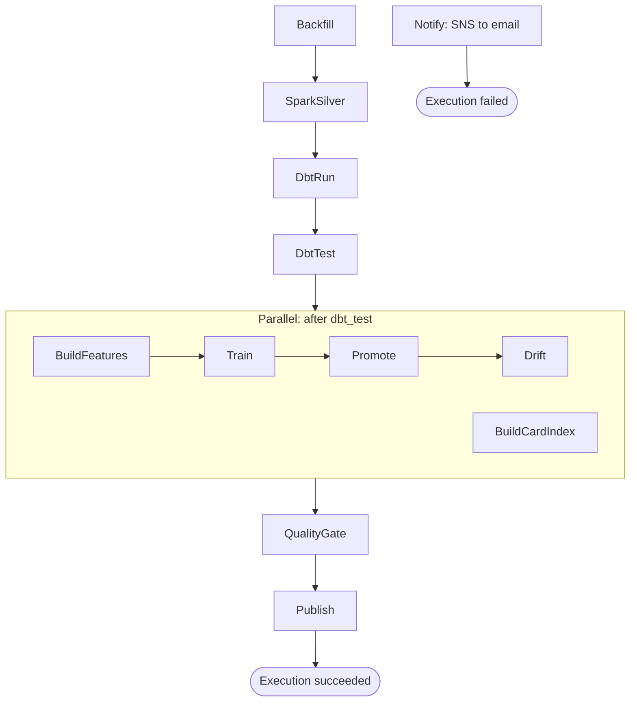

# Orchestration on AWS

The README and `docs/stages.md` list AWS (Amazon Web Services) Step Functions
as the stretch, managed alternative to Airflow. This document is that
stretch, cut to a design: the state machine's shape, why, roughly what it
costs, and when it is worth building. Nothing here is deployed; no AWS call
was made and no container was built writing it, and every number below is
arithmetic on published rates, not a bill.

Why a design and not a stack: `docker compose up -d airflow` already
satisfies the requirement, runs anywhere Docker does, one command, no AWS
account needed ([docs/demo.md](demo.md)). Standing up an ECS (Elastic
Container Service) cluster, a task role, and a database for MLflow to run a
pipeline a laptop already runs correctly would be infrastructure with no
user, so this is what gets built the day that stops being true.

## The state machine

A single Step Functions **Standard** state machine, defined in the analytics
application's own Cloud Development Kit (CDK) stack
(`infra/lib/constructs/pipeline-events.ts`), not in this repository. Standard
rather than Express: `spark_silver` and `dbt_run` run past Express's
five-minute limit, and Standard keeps a full execution history for when a run
fails overnight. It also runs each state exactly once per attempt, matching
the pipeline's own idempotent, partition-replace design. It mirrors
`orchestration/airflow/dags/play_rough_pipeline.py` one to one: the same ten
stage names, the same order, the same one branch.

| Airflow task | Step Functions state | how it runs |
|---|---|---|
| `backfill` | `Backfill` | Fargate RunTask, `pipeline.backfill` |
| `spark_silver` | `SparkSilver` | Fargate RunTask, `pipeline.silver` |
| `dbt_run` | `DbtRun` | Fargate RunTask, `pipeline.gold --steps run` |
| `dbt_test` | `DbtTest` | Fargate RunTask, `pipeline.gold --steps test` |
| `build_features`, `train`, `promote`, `drift` | one `Parallel` branch | chained in order, unchanged |
| `build_card_index` | the other branch | nothing downstream reads its output either |
| `quality_gate` | `QualityGate` | after the `Parallel` state joins |
| `publish` | `Publish` | last state before success |

The `Parallel` state is the one non-literal spot. Airflow's graph has
`dbt_test >> build_card_index` with no edge after it, a leaf, but a DAG run
does not finish until every task reaches a terminal state. A `Parallel` state
behaves the same way (it does not complete until every branch does), so
joining the branches before `quality_gate` only makes explicit an edge
Airflow already guarantees implicitly.

### Execution engine, task definition, secrets

Every state is an `EcsRunTask` against AWS Fargate on the `.sync` integration
pattern (`IntegrationPattern.RUN_JOB`), blocking until the ECS task exits and
turning its code into success or `States.TaskFailed`. The light stages
(`quality_gate`, `publish`, `drift`) would likely fit under Lambda's 10 GB
image limit; the recommendation is Fargate for all ten anyway, one IAM
(Identity and Access Management) permission shape, one logging setup, one
build target for one Python package rather than two.

One shared ECS task definition and image, built the way `Dockerfile` already
builds the event consumer (dependencies from `uv.lock`, `pipeline` on top, no
model or data baked in), except the command is left open for each state to
override with `["python", "-m", "pipeline.<stage>", ...]`. One task role,
not one per stage, carrying exactly what the application's
`PipelineReaderRole` already grants this pipeline (`GetObject` and
`GetObjectVersion` under `parsed/`, `ListBucket` scoped to that prefix,
`GetObject` on the card catalog, receive and delete on the parsed-games
queue, `PutItem`, `BatchWriteItem`, `DeleteItem`, `Query` on the insights
table, `pra-<stage>-insights`), nothing new the stages do not already use
through boto3's default chain.

Secrets move from 1Password to Secrets Manager or SSM (Systems Manager)
Parameter Store. `.env.op` and `.env.dev.op` hold `op://Vault/item field`
references for `HANDLE_HMAC_KEY` and `ANTHROPIC_API_KEY` (the key a future
agent stage would call a language model with), resolved by `op run` locally.
Each becomes one Secrets Manager secret or SSM `SecureString`, resolved into
the container by the task definition's `secrets` map at task start; the task
role gets `secretsmanager:GetSecretValue` (or `ssm:GetParameter`) on exactly
those two, the narrowing a 1Password vault does today, moved to AWS.

### Retries, failure, and the run identifier

Every state retries on `States.TaskFailed`, 2 attempts, backoff rate 2
(roughly 30 seconds then 60), the reasoning behind Airflow's one retry on
`backfill`: a network call fails for a reason gone a minute later, a failed
dbt test fails the same way every time. Every state also carries a `Catch`
on `States.ALL` to one `Notify` state (`SnsPublish`), posting the failing
state, its error and the run identifier to an SNS (Simple Notification
Service) topic with an email subscription, then a `Fail` state ends the run.

`PRA_RUN_ID` is set on every container override to `$$.Execution.Name`, the
Amazon States Language context path for the execution's own name, the direct
analogue of Airflow's `{{ run_id }}`: it lands on every log line and
`run_metrics` row, so finding what a run did is one filter, on the execution
name in Logs Insights and on `run_id` in the Parquet files.

### Where the state lives

With no laptop, `meta.duckdb` needs a home a stateless task can reach: an EFS
(Elastic File System) volume mounted into every task, or no persistent
warehouse, `dbt_run` rebuilding it from bronze and silver Parquet on S3 each
execution, the way a fresh clone does today. Recommendation: rebuild.
`docs/stages.md` already says why, the DuckDB file "holds no state worth
keeping," and an EFS-mounted file adds a lock-contention problem this
pipeline does not otherwise have (overlapping executions, or a retried task,
over the network) for a database that reconstructs itself in the time
`dbt_run` already takes; rebuild-from-S3 also makes a retried state safe to
run twice.

`data/mlruns` needs a home too: an MLflow server as a small, always-on
Fargate service, backed either by RDS (Relational Database Service, a small
Postgres instance) with an S3 artifact store, or a file store on EFS, the
`MLFLOW_ALLOW_FILE_STORE` mode the model commands already set locally.
Recommendation: RDS. The file store's own documentation warns it is unsafe
under concurrent writers, and the registry it protects is what `promote`
reads to pick which model answers `/predict`; a corrupted `meta.yaml` is a
silent wrong answer, not a crash anyone notices, and the cost difference,
a few dollars a month, is cheap insurance against exactly that.

### Schedule and logs

An EventBridge Scheduler schedule, one fixed UTC hour a day
(`cron(0 6 * * ? *)`), calls `StartExecution` (an EventBridge `Rule` with an
`SfnStateMachine` target does the same on the older API). Every container
already writes CloudWatch Logs as one JSON object per line, so Logs Insights
needs no custom parser: `fields @timestamp, stage, run_id, msg | filter
stage = "silver"` works as-is. One CloudWatch alarm on `ExecutionsFailed`
(namespace `AWS/States`) notifies the same SNS topic, catching a run that
fails before any state's own `Catch` does.

## CDK sketch (illustrative)

Not meant to compile as written; `pipelineCluster`, `pipelineTaskDef`,
`pipelineContainer` and `failureTopic` are declared elsewhere in the real
stack. It shows the shape: a helper wrapping one stage in retry and catch, a
`Parallel` for the branch after `dbt_test`, and a daily schedule.

```typescript
import { Duration } from "aws-cdk-lib";
import * as sfn from "aws-cdk-lib/aws-stepfunctions";
import * as tasks from "aws-cdk-lib/aws-stepfunctions-tasks";
import * as scheduler from "aws-cdk-lib/aws-scheduler";
import * as targets from "aws-cdk-lib/aws-scheduler-targets";

function stage(id: string, command: string[]): sfn.IChainable {
  const task = new tasks.EcsRunTask(this, id, {
    integrationPattern: sfn.IntegrationPattern.RUN_JOB, // the ".sync" pattern
    cluster: pipelineCluster,
    taskDefinition: pipelineTaskDef,
    launchTarget: new tasks.EcsFargateLaunchTarget(),
    containerOverrides: [{
      containerDefinition: pipelineContainer,
      command,
      environment: [
        { name: "PRA_RUN_ID", value: sfn.JsonPath.stringAt("$$.Execution.Name") },
      ],
    }],
    resultPath: sfn.JsonPath.DISCARD,
  });
  task.addRetry({ errors: ["States.TaskFailed"], maxAttempts: 2, backoffRate: 2 });
  task.addCatch(notify, { errors: ["States.ALL"], resultPath: "$.error" });
  return task;
}

const notify = new tasks.SnsPublish(this, "NotifyFailure", {
  topic: failureTopic,
  message: sfn.TaskInput.fromJsonPathAt("$.error"),
}).next(new sfn.Fail(this, "RunFailed"));

const afterDbtTest = new sfn.Parallel(this, "AfterDbtTest")
  .branch(
    (stage("BuildFeatures", ["python", "-m", "pipeline.gold", "--steps", "run", "--select", "tag:ml"]) as sfn.Chain)
      .next(stage("Train", ["python", "-m", "pipeline.train"]))
      .next(stage("Promote", ["python", "-m", "pipeline.promote", "--candidate", "latest"]))
      .next(stage("Drift", ["python", "-m", "pipeline.drift"])),
  )
  .branch(stage("BuildCardIndex", ["python", "-m", "pipeline.card_index"]));

const definition = sfn.Chain.start(stage("Backfill", ["python", "-m", "pipeline.backfill"]))
  .next(stage("SparkSilver", ["python", "-m", "pipeline.silver"]))
  .next(stage("DbtRun", ["python", "-m", "pipeline.gold", "--steps", "run"]))
  .next(stage("DbtTest", ["python", "-m", "pipeline.gold", "--steps", "test"]))
  .next(afterDbtTest)
  .next(stage("QualityGate", ["python", "-m", "pipeline.quality_gate"]))
  .next(stage("Publish", ["python", "-m", "pipeline.publish"]));

const stateMachine = new sfn.StateMachine(this, "PipelineStateMachine", {
  definitionBody: sfn.DefinitionBody.fromChainable(definition),
  stateMachineType: sfn.StateMachineType.STANDARD,
  timeout: Duration.hours(2),
});

new scheduler.Schedule(this, "DailyRun", {
  schedule: scheduler.ScheduleExpression.cron({ hour: "6", minute: "0" }),
  target: new targets.StepFunctionsStartExecution(stateMachine),
});
```

## The state machine, drawn



Every state above also carries a `Catch` on `States.ALL` to `Notify`; those
edges are left off so the diagram stays readable as the happy path.

## Airflow, or Step Functions

Airflow in Compose is the right shape today; Step Functions is the right
shape for a later state, not a better version of the same thing.

**Choose Step Functions when** the pipeline already runs in AWS and nobody
wants a server to keep up: no scheduler to patch, no metadata database to
back up, no container alive between runs, cost following use exactly (per
state transition, per Fargate task-second), and IAM-native permissions, one
task role, no second credential system beside it.

**Stay with Airflow when** development happens on a laptop, which this
project's test suite and demo are built around ([docs/demo.md](demo.md) runs
the whole pipeline in about twenty seconds, no AWS account). A date-range
backfill is a DAG run with a `--conf` parameter and a UI listing every run
next to its task logs, where Step Functions is a hand-built `StartExecution`
payload with no equivalent view. Airflow's DAG authoring is dynamic Python
(this DAG already branches on `ingest_mode`) where a Step Functions
definition is static, generated once by CDK, and Airflow's operator ecosystem
is what would carry this pipeline to a sensor-driven trigger later
(`docs/stages.md`'s "still to come": start on new bronze partitions instead
of a clock) rather than custom EventBridge wiring.

This repository runs Airflow in Compose because it has to run anywhere
Docker does, for a reviewer with no AWS account, in one command. The Step
Functions path is the deployment shape for the day a team wants it
unattended in AWS instead: designed, not needed yet.

## Rough monthly cost

At today's corpus size, a few thousand games, one run a day, everything
rounds to almost nothing except the always-on MLflow service. Rates below are
approximate, list-price, us-west-2 figures, rounded for easy arithmetic.

- **Fargate task-minutes:** roughly 15 to 20 minutes of total task time a day
  (`spark_silver`, `dbt_run` are the long ones), a blended 2 vCPU / 4 GB task
  size, about 0.5 vCPU-hours and 1 GB-hour a day; at $0.04 per vCPU-hour and
  $0.004 per GB-hour, **under $2 a month**.
- **State transitions:** $0.025 per 1,000, one execution touches 15 to 20,
  and 30 executions a month stays under 1,000, **a few cents**.
- **EventBridge Scheduler, SNS:** one invocation a day, a handful of emails,
  both **effectively free**.
- **CloudWatch Logs:** a few megabytes of JSON lines a day, **under $1 a
  month**.
- **MLflow, the dominant line:** it runs all day rather than a few minutes, a
  small always-on Fargate service around $9 a month in compute, plus the
  smallest RDS instance (roughly $15) and a little S3 storage, **$25 to $30
  a month** total; the EFS file-store alternative drops the RDS line for
  **$10 to $12 a month**, at the concurrency risk described above.

**Total, recommended option: roughly $30 a month.** MLflow, not the
pipeline's own compute, is almost the entire bill, the one piece of this
design that is not naturally serverless.

## What would have to change in the pipeline code

- **Nothing in the stage modules.** Every stage under `pipeline/` already
  reads its configuration from environment variables and exits non-zero on
  failure, exactly the contract `EcsRunTask` needs to turn an exit code into
  `States.TaskFailed`.
- **Nothing for AWS credentials.** The container needs the task role's
  temporary credentials, picked up automatically by boto3's default
  credential chain, the same one every stage already uses.
- **`python -m pipeline.run_all` stops being used.** It is the no-scheduler
  runner for a laptop or an unorchestrated container; the state machine is
  the runner instead, calling each stage command directly.
- **`.env.op` and `.env.dev.op` are replaced by task definition secrets.**
  The two `op://` references become two Secrets Manager secrets or SSM
  parameters, resolved into the container by the task definition instead of
  by `op run` on a developer's machine.
